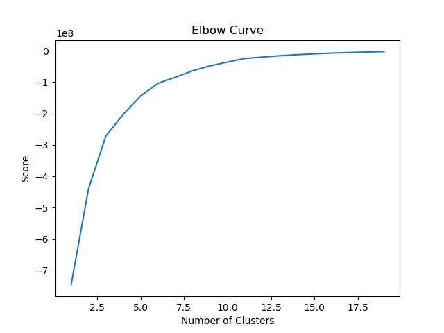
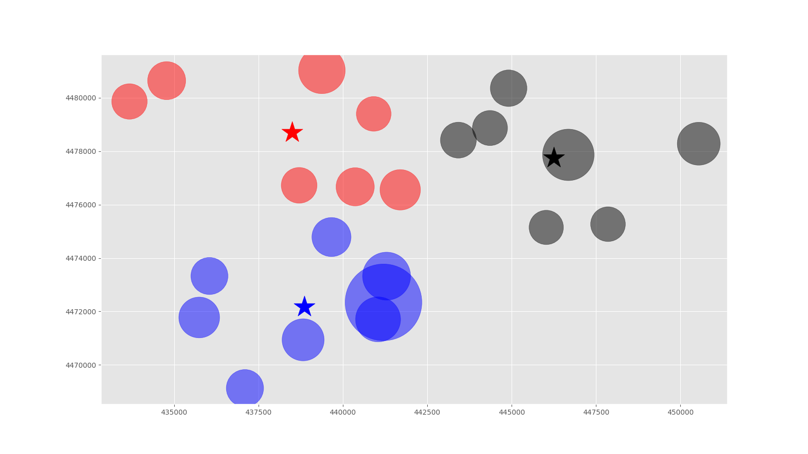
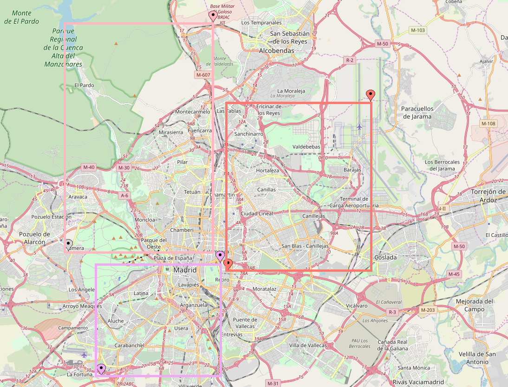

# Descripción
Aplicación para detectar analizar los retrasos en las paradas de autobus de la EMT e identificar zonas con conflictos circulatorios

# Requisitos
Python 2.7.15 o 3.7.3

# Instalación
python pip install

# Ejecución
* Genera un dataframe con el 40% de paradas que presenta una media de retrasos más alta a partir de los datos de EMT_tiempos_espera.txt y EMT_coordenadas_paradas.txt
		python .\dataframe.py

* Busca el número de clusters (K) óptimos
		python .\kmeans_elbow.py

* Dibuja un gráfico scatter con el resultado
		python .\kmeans_draw.py

# Funcionamiento
## Dataframe.py
1. Lectura del fichero EMT_tiempos_espera.txt
2. Cálculo de la diferencia entre tiempo real y tiempo estimado
3. Cálculo del porcentaje de desviación
4. Filtrado de las paradas que tienen retrasos
5. Agrupación de los datos por parda y retrasos diarios
6. Selección del 40% de las paradas que acumulan mayores retrasos
7. Cruze de datos con su geo-posición en el fichero EMT_coordenadas_paradas.txt
8. Escritura del fichero dataframe.txt para el análisis de cluster

## Kmeans_elbow.py
1. Lectura del fichero dataframe.txt
2. Selección de las columnas "x","y","delay"
3. Aplicar K-Means en un rango de 1..20
4. Dibujar el gráfico Elbow Curve
5. Seleccionar visualmente el valor K (3).

## Kmeans_draw.py
1. Lectura del fichero dateframe.txt
2. Selección de las columnas "x","y","delay"
3. Establecer el valor de los clusters según K (3)
4. Asignar colores para los diferentes clusters
6. Dibujar el gráfico scatter con los centroides, clusters y tamaño según su delay (cuando mayor delay, más grande es el círculo)

# Conclusiones
Según los datos disponibles en el dataset: EMT_tiempos_espera.txt, las paradas del servicio de Bus de la EMT presentan un comportamiento similar respecto a sus retrasos medios en tres grupos diferenciados.
Geográficamente: 
* (435000,4468000),(442500,4475000): (40.3600311068106,-3.76551537041841),(40.4236426758616,-3.67782489816052)
* (433000,4475800),(442200,4490000): (40.4301375365722,-3.78988828912945),(40.5587477727889,-3.68272925936457) 
* (443000,4474500),(452000,4485000): (40.4191728675406,-3.67188633895446),(40.5143321122445,-3.56659874045442)

